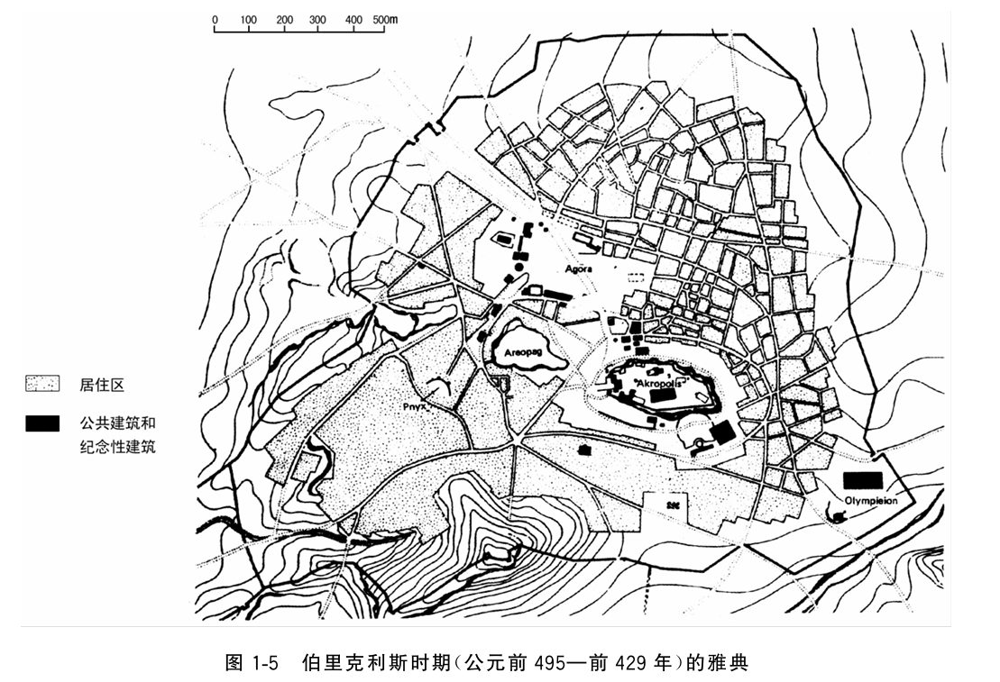

# 第一章

> 无论你身处何处，死亡总将降临你身，即使登上高塔也不例外。
> <div style="text-align: right;">——《古兰经》4:78</div>

## 基本信息
- **章节名称**：
- **章节目标**：玩家熟悉整合包主线剧情的基本流程，尝试让玩家习惯任务日志式的、侧重剧情的任务设计，引入追求本源的失落文明。
- **预计时长**：3-4 小时

## 节点
### 引子  
**游戏阶段**（玩家发展到一定阶段）：   
当玩家回到舰队时，大副急忙将一封来自总督的信函送到玩家手上，要求玩家尽快到总督府。  
当玩家来到总督府时，总督正在和牧师谨慎的交流。在玩家面前，总督拿出了虚空魂瓮——在里面容纳着被魔力侵蚀的灵魂，在冒险家击杀亡灵时掉落。虽然魔力侵蚀人类的现象时有发生，但这些奇异的灵魂在过去闻所未闻。  
更关键的是，这些灵魂似乎受到某种力量的引导，指引向一个特定的地点。总督希望玩家能够前往那里，调查原因。

---
**主动发现**（玩家获取了虚空魂瓮或看到了虚空之魂）：  
玩家认出了这些奇特的存在是被魔力侵蚀的灵魂，但这种奇异的灵魂在过去闻所未闻。于是，玩家前往总督府，向总督汇报这一发现。  
当玩家来到总督府时，总督正在和牧师谨慎的交流。总督也拿出了虚空魂瓮，它在冒险家击杀亡灵时掉落。和玩家一样，总督也认为这些灵魂不同寻常。更关键的是，这些灵魂似乎受到某种力量的引导，指引向一个特定的地点。总督希望玩家能够前往那里，调查原因。

### 久远之梦
玩家将虚空魂瓮制作成指南针，跟随着它的指引，来到了一座废墟前（所以可以生成虚空之魂的废墟）。和黎明群岛的其他遗迹一样，经过岁月的洗礼，这里已经变成了魔物们的乐园。但和其他遗迹不同，这里的生物仿佛是遗迹的原住民，仍旧仿佛在按部就班的生活着。  
玩家击杀了这些魔物，收集了掉落的虚空之魂。在废墟里，玩家发现了琥珀与一些关于君王和王都的线索（剧情相关）。玩家将琥珀制作成琥珀航标（暂命名，与航线系统相关，在舰队上会点亮该结构位置及附近的灯塔）。

### 琥珀王都
玩家来到了琥珀航标所指之处。但是这里除了一座高耸的牌楼外一无所有。在牌坊的前方有4个基座，其中两个基座上放置着虚空魂瓮，并从魂瓮里射出射线，指向牌楼上的琥珀块。通过简单的解谜，玩家将另外两个基座上也放置了虚空魂瓮，在射线所指向的位置放置了琥珀块。随着最后一个琥珀块的放置，牌楼中心激活了一个传送门。玩家进入传送门进入失落之城——琥珀王都。琥珀王都魔力充盈，玩家的魔力恢复速度与稳态魔力上限提高。
- **卫城**：进入王都，玩家会生成在卫城的公民广场上。在广场上，流荡着许多亡灵生物（僵尸变种/僵尸村民等）与夺躯者——他们曾是王都的居民，但在灾难中被魔力侵扰变成了怪物。皇宫在广场前方更高的山上，玩家需要通过两侧的神庙与祭坛到达皇宫。在两侧的建筑里，除了魔物外，有着更加强大堕落骑士和虚空魂骑士守卫着前往皇宫的必经之路。
- **皇宫**：相较于卫城，皇宫更为华丽，但也更加破败。皇宫里早已人去楼空，只有堕落骑士流荡着。玩家继续前进，皇宫的第二层有着埃尔德骑士。埃尔德骑士曾经是王国的大将军，虽然在灾难的中心，却仍保留着守卫皇宫的本能。埃尔德骑士将会被作为琥珀王都的Boss，它会在在受伤时召唤埃尔德炸弹攻击玩家。在击败琥珀王都的Boss后，玩家可以继续向前，最终在皇宫顶层发现一个传送门。玩家使用琥珀激活传送门，回到主世界，生成在君王陵寝的入口处。
### 君王陵寝
君王陵寝位于主世界。在其入口处，玩家会在附近的帐篷中找到一个原住民NPC作为引导（世界观与传说/游戏性/储存点）。如果在君王陵寝中死亡，玩家身上的物品会恢复到进入陵寝时的状态（后继主线的结构也多半如此）。玩家可以选择直接进入，也可以在休整后从长计议。
- **地表**：在陵寝的入口，两只石像鬼守卫着大门。石像鬼在白天会保持石化状态，夜晚则会苏醒并攻击玩家。玩家需要击败石像鬼才能进入陵寝内部。石像鬼会掉落钥匙，玩家使用钥匙、并释放指定流派的法术激活传送门。进入君王陵寝，玩家的游戏模式将会被切换成伪冒险模式（不允许破坏、放置方块）。
- **第一层**：古陵的第一层错综复杂，有许多不同的房间，旨在对于君王日常生活的全方面模拟。在第一层游荡着缚魂盔甲骑士与缚魂盔甲弓手，刷怪笼则会刷新木乃伊僵尸。虽然错综复杂，但是第一层整体呈现出线性结构，玩家沿着主路就可以到达前往第二层的楼梯。此外第一层也有一些墓穴```'darkerdepths:tomb'```，墓穴中刷新的木乃伊更加强大，且会掉落一些稀有材料。
- **第二层**：第二层整体呈现出“亞”字形，中央广场中有着一个缚魂盔甲审判官作为小Boss和少量缚魂盔甲弓手。击败审判官后，中央广场通向第三层的楼梯才会被解锁。
- **第三层**：第三层相较于前两层格外开阔，在其中央有着高耸的立柱。在陵寝的尽头，君王端坐在王座上，在王座的下方，则是君王的墓穴。在玩家打开墓穴之后，君王才会被激活。君王是一个有着三个阶段的Boss：
    - 第一阶段：君王在第一阶段不会受到直接伤害。相反，君王会召唤僵尸、缚魂盔甲骑士和缚魂盔甲弓手攻击玩家，玩家击败这些小怪后君王也会受到伤害。
    - 第二阶段：君王开始主动攻击。君王依旧不会移动，但会使用强大魔法攻击（射线等）。君王在正常时只能受到较少的法术伤害和近战伤害，但当君王使用攻击后会进入较长的虚弱状态，玩家需要把握时机进行攻击。当玩家在虚弱状态受到大量伤害时，会延长君王的虚弱时间。
    - 第三阶段：当君王的血量少于40%时，君王进入第三阶段。君王变得狂暴会从王座上站起来，使用近战和法术结合的攻击方式，且攻击频率和伤害都会大幅提升，玩家需要在这个阶段集中精力躲避君王的攻击。但与此同时，君王受到的伤害也会提升，只要玩家能够躲避住君王的攻击，就能造成大量伤害。  
    ---
    在君王死亡时，君王的肉体会逐步瓦解，最终完全消失，掉落魔力结晶化的君王之心。玩家将君王之心放置在君王的墓穴中，便可以激活传送门回到主世界。（世界观设定：君王是不死的，君王之心会在君王死亡后在墓穴里逐步恢复君王的肉体）


## 世界观背景
现世的君王建立起了庞大的帝国，几乎统治了整片群岛。君王坐在皇宫之上，他的目光越过层叠的廊柱，漠然地看着臣民们俯首听命。他已经年过半百，金玉如山，权柄倾国，但十余年的统治已经将世间一切欢愉碾磨成枯燥的沙砾。君王沉思着。人类最大的局限是肉体的短暂，他要的，不仅仅是权力与财富。他想要不朽。  
他集结了宫廷中最卓越的魔法使与学者，开始了对于本源的首次尝试。实验庄严而静谧。学者们轻柔地引导魔力涌入君王的魔力脉络，庄严地地为君王涂抹圣油。君王用自己的身躯容纳了足以令山川变色的魔力。并斩断了自身与外界的魔力流转。如此，时间被冻结了，那一瞬的君王，成为了永恒。当然，人类的身躯并不能承载这么巨大的魔力，魔法使们在宫廷里绘制了大量法阵与符文，以稳定君王体内魔力的平衡。这次实验非常成功，君王几乎触及了不朽。  
然而，作为代价，君王不能离开布满法阵的皇宫一步。在漫长的岁月里，君王的意识逐渐模糊，枯燥的生活让他麻木。他仍是现世之王，却也是一个被困在皇宫里的囚徒.他不愿对外界发号圣旨，宫墙之外的世界对他而言已是隔世幻影。臣民们依然行礼如仪，只是那份敬畏，早已被岁月的风霜打磨成冰冷的仪式。  
改变发生在君王永生之后又 200 年。海风，年复一年地侵蚀着皇宫，宫殿需要时常修缮。在一次暴雨过后，一片斑驳的墙体脱落了。这片墙体上附着着法阵的一处重要节点，但是由于廷臣的疏忽，节点并没有被及时修复。灾难爆发了。积压已久的魔力开始涌动，复杂的法阵被一一破坏，君王的魔力平衡被打破。臣民们尝试修复法阵，但最终为时已晚。  
终于，君王体内的魔力爆发，磅礴的魔力凝结成晶体，吞没了整座王都。魔力侵蚀着王都的国民，臣民的肉体变异扭曲、理智崩溃，最终变成了无意识的怪物。君王也被魔力侵蚀，失去了意识，只有着身为威严君王的本能。王都在这场灾难中被彻底摧毁了。  
在灾难结束后，臣民们将君王埋葬在一座远离国都的海岛上，这是君王家族世代的陵寝。与亡灵们不同，君王虽然意识消散，但肉体仍然存活。学者们的实验还是成功了，在魔力的引导下，君王的肉身形成了自成一方而与外界隔绝的微缩世界，这个小世界维持着自身——也就是君王肉体的不死。魔法使们做了诸多限制，在陵寝与王都设下重重禁制，既防止后世之人进入，也防止君王的魔力再次带来灾厄。


## 技术性与玩家体验
### 核心模组
- 深岩之下 Darker Depths
- 传说与神话 Myths and Legends

### 核心材料
- 琥珀 ```darkerdepths:amber```
- 遗弃青铜锭 ```darkerdepths:forsaken_bronze_ingot```
- 虚空之魂（虚空魂瓮）```darkerdepths:void_soul_jar``` 【扩大其生成范围，指定生物或指定结构里的生物会稳定掉落，详见 [虚空之魂生成列表](/模组修改/虚空之魂生成列表.md)】
- 缚魂锭（首次引入，游戏后期的常见材料）```mythsandlegends:bound_soul_ingot```

### 核心生物

**帝王陵寝**：
- 缚魂盔甲骑士
- 缚魂盔甲弓手
- 缚魂盔甲审判官
- 石像鬼
- 木乃伊
- 君王（Boss）

**琥珀王都**：
- 夺躯者
- 虚空魂骑士
- 埃尔德骑士（埃尔德炸弹）
- 堕落骑士

### 核心建材

- 以暗色/暖色为主的岩石，包括暮色石、干裂岩、泥巴、幽暗板岩等。
- 受到魔力侵蚀的紫色建材

### 核心建筑
- [虚空之魂生成列表](/模组修改/虚空之魂生成列表.md) 中的结构都可以触发
- 琥珀王都：位于独立维度的原创建筑，一座在海洋中耸立的都城废墟。以古希腊城市为蓝本，但根据实际工作量和游戏性优化了居民区，仅保留卫城。
- 君王陵寝: 位于独立维度的原创建筑，埋于地下的迷宫建筑。形制可以参考 EEEAB's Mobs 的古陵

(雅典城，来自清华大学出版社《城市规划》)


### 游戏阶段

- 原版：钻石剑 - 下界合金剑（未附魔） 之间