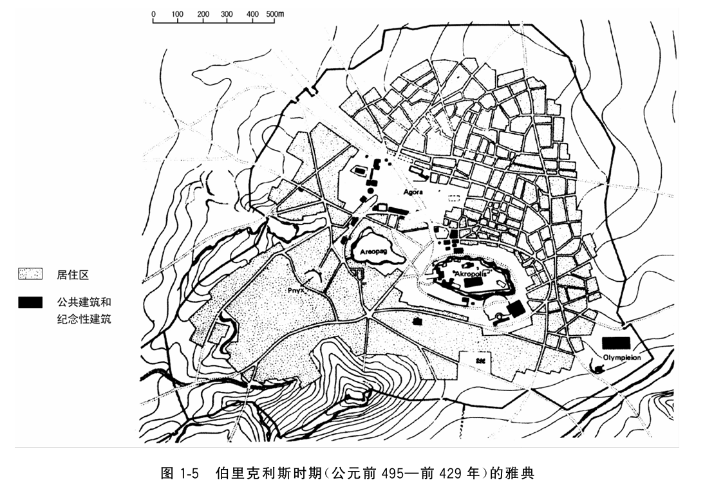
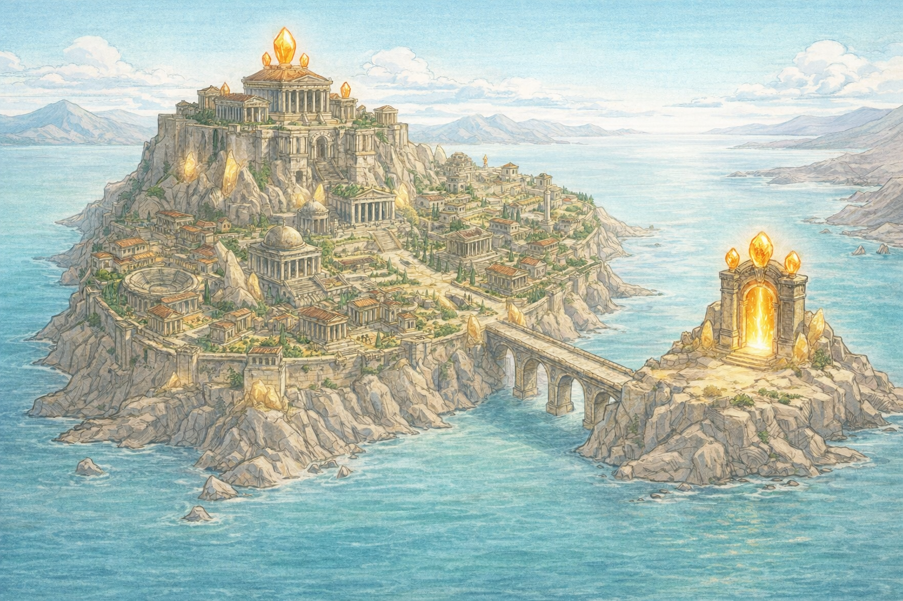

# 第一章

> 无论你身处何处，死亡总将降临你身，即使登上高塔也不例外。
> <div style="text-align: right;">——《古兰经》4:78</div>

## 基本信息
- **章节名称**：（待定）
- **章节目标**：引导玩家熟悉整合包主线剧情的基本流程，适应以任务日志为核心、偏重剧情叙事的任务设计风格，并初步引入“追求本源的失落文明”这一核心世界观主题。
- **预计时长**：3-4 小时

## 节点
### 引子  
共有两种触发方式，取决于玩家的行动路径。  
**方式一：接到总督的密信（被动触发）**：   
当玩家返回舰队时，大副匆匆递上一封来自总督的信函，要求玩家尽快前往总督府。  
玩家抵达总督府后，发现总督正与一位牧师低声交谈，神情谨慎。在玩家面前，总督取出了一个**虚空魂瓮**——其中囚禁着被魔力侵蚀的灵魂，这些灵魂在冒险家击杀亡灵时掉落。  
尽管魔力侵蚀人类已非罕见，但如此形态的灵魂却前所未见。更令人不安的是，这些灵魂似乎受到某种无形力量的引导，指向同一处地点。  
总督希望玩家能前往该地，查明真相。  

---
**方式二：主动发现（主动触发）**： 
玩家在探索中偶然获得了虚空魂瓮，或亲眼见到了虚空之魂，认出这些是被魔力侵蚀的灵魂，却也察觉到它们与此前所知的任何灵魂都不同。  
于是，玩家主动前往总督府汇报这一发现。  
总督同样取出了虚空魂瓮——他在冒险家击杀亡灵时也有所收集。两人核对后发现，这些灵魂确实异于常理，且似乎被某种力量牵引，指向一个特定方位。总督遂委托玩家前往调查。  

### 久远之梦
玩家将虚空魂瓮用作指南针，跟随指引来到一座废墟前（该废墟属于[虚空之魂生成列表]中定义的结构）。  
与黎明群岛其他遗迹不同，这片废墟同样饱经风霜，已经变成了魔物们的乐园——但是，其中的生物仿佛是原住民，依旧按部就班地“生活”着，如同时间在此处停滞。  
玩家需要击败这些魔物，收集掉落的虚空之魂。  
在废墟深处，玩家发现了琥珀以及若干关于“君王”与“王都”的线索（剧情关键）。  
将琥珀制作成琥珀航标（暂定名，与航线系统相关），在舰队上使用时，会点亮该结构的位置及附近灯塔。  

### 琥珀王都

琥珀航标指向一处空旷之地，然而除了一座高耸的牌楼之外，别无他物。  
牌楼前设有四个基座，其中两个已放置虚空魂瓮，并从瓮中射出射线，指向牌楼上的琥珀块。  

#### 解谜流程：  
玩家需在剩余两个基座上放置虚空魂瓮，并在射线所指位置嵌入琥珀块。当最后一个琥珀块就位，牌楼中央会激活一道传送门。  
踏入传送门，玩家将进入失落之城——琥珀王都。  

> 区域特性：琥珀王都内魔力充盈，玩家的魔力恢复速度与稳态魔力上限均获得提升。  

#### 卫城
- 玩家生成于传送门前。向前行进，走过桥梁，即抵达卫城的公民广场。
- 广场上游荡着大量亡灵生物（僵尸变种、僵尸村民等）与夺躯者——他们曾是王都的居民，在魔力灾难中扭曲成怪物。
- 皇宫坐落在广场前方的更高山丘上，需要通过两侧的神庙与祭坛才能抵达。
- 在两侧建筑中，除了普通魔物，还有更强大的**堕落骑士**与**虚空魂骑士**守卫着通往皇宫的要道。

#### 皇宫
- 皇宫比卫城更为华丽，但也更加破败，人去楼空，只有**堕落骑士**在其中游荡。
- 第二层守卫着埃尔德骑士——王国昔日的将军，虽身处灾难中心，仍保留着守卫皇宫的本能。
    - Boss 战特性：埃尔德骑士受伤时会召唤埃尔德炸弹攻击玩家。
- 击败埃尔德骑士后继续深入，最终在皇宫顶层发现一个传送门。
- 玩家使用琥珀激活传送门，返回主世界，并被传送至君王陵寝入口。

### 君王陵寝
君王陵寝位于主世界。入口附近的帐篷中有一位原住民NPC，为玩家提供引导（世界观/传说、游戏机制提示、储存点功能）。
> **特殊机制**：若在君王陵寝中死亡，玩家身上的物品将恢复至进入陵寝前的状态。后续主线结构大多沿用此规则。

玩家可以选择直接进入，也可以在休整后从长计议。  

#### 地表
- 陵寝入口由两只石像鬼守卫。白天石像鬼保持石化状态，夜晚则会苏醒并攻击玩家。
- 击败石像鬼后获得钥匙，玩家需使用钥匙并释放指定流派的法术，方可激活传送门。
- 进入陵寝后，游戏模式切换为伪冒险模式（不允许破坏或放置方块）。

#### 第一层
- 结构错综复杂，包含多个房间，旨在模拟君王的日常生活场景。
- 游荡怪物：缚魂盔甲骑士、缚魂盔甲弓手；刷怪笼会刷新木乃伊僵尸。
- 整体呈线性结构，沿主路即可抵达通往第二层的楼梯。
- 另有若干墓穴（darkerdepths:tomb），其中的木乃伊更为强大，但会掉落稀有材料。

#### 第二层
- 整体呈“亞”字形布局。
- 中央广场有一名缚魂盔甲审判官（小Boss）及少量缚魂盔甲弓手。
- 击败审判官后，通往第三层的楼梯才会解锁。

#### 第三层
- 空间格外开阔，中央矗立着高耸的立柱。
- 陵寝尽头，君王端坐于王座之上，王座下方是他的墓穴。
- 玩家需打开墓穴，君王才会被激活。

君王是一个有着三个阶段的Boss：
    - 第一阶段：君王不直接受伤害，而是召唤僵尸、缚魂盔甲骑士与弓手攻击玩家。击败小怪会对君王造成伤害。
    - 第二阶段：君王开始主动攻击。但本体不移动，但会使用强大魔法攻击（射线等）。君王在正常状态时只能受到较少的法术伤害和近战伤害，但当君王使用攻击后会进入较长的虚弱状态，玩家需要把握时机进行攻击。当玩家在虚弱状态受到大量伤害时，会延长君王的虚弱时间。
    - 第三阶段：当君王的血量少于40%时，君王进入第三阶段。君王变得狂暴会从王座上站起来，使用近战和法术结合的攻击方式，且攻击频率和伤害都会大幅提升，玩家需要在这个阶段集中精力躲避君王的攻击。但与此同时，君王受到的伤害也会提升，只要玩家能够成功闪避君王的攻击，就能造成大量伤害。  
    ---
    在君王死亡时，君王的肉体会逐步瓦解，最终完全消失，掉落魔力结晶化的君王之心。玩家将君王之心放置在君王的墓穴中，便可以激活传送门回到主世界。（世界观设定：君王是不死的，君王之心会在君王死亡后在墓穴里逐步恢复君王的肉体）


## 战利品

- 传奇法术：

## 世界观背景
现世的君王建立起了庞大的帝国，几乎统治了整片群岛。君王坐在皇宫之上，他的目光越过层叠的廊柱，漠然地看着臣民们俯首听命。他已经年过半百，金玉如山，权柄倾国，但十余年的统治已经将世间一切欢愉碾磨成枯燥的沙砾。君王沉思着。人类最大的局限是肉体的短暂，他要的，不仅仅是权力与财富。他想要不朽。  
他集结了宫廷中最卓越的魔法使与学者，开始了对于本源的首次尝试。实验庄严而静谧。学者们轻柔地引导魔力涌入君王的魔力脉络，庄严地地为君王涂抹圣油。君王用自己的身躯容纳了足以令山川变色的魔力。并斩断了自身与外界的魔力流转。如此，时间被冻结了，那一瞬的君王，成为了永恒。当然，人类的身躯并不能承载这么巨大的魔力，魔法使们在宫廷里绘制了大量法阵与符文，以稳定君王体内魔力的平衡。这次实验非常成功，君王几乎触及了不朽。  
然而，作为代价，君王不能离开布满法阵的皇宫一步。在漫长的岁月里，君王的意识逐渐模糊，枯燥的生活让他麻木。他仍是现世之王，却也是一个被困在皇宫里的囚徒.他不愿对外界发号圣旨，宫墙之外的世界对他而言已是隔世幻影。臣民们依然行礼如仪，只是那份敬畏，早已被岁月的风霜打磨成冰冷的仪式。  
改变发生在君王永生之后又 200 年。海风，年复一年地侵蚀着皇宫，宫殿需要时常修缮。在一次暴雨过后，一片斑驳的墙体脱落了。这片墙体上附着着法阵的一处重要节点，但是由于廷臣的疏忽，节点并没有被及时修复。灾难爆发了。积压已久的魔力开始涌动，复杂的法阵被一一破坏，君王的魔力平衡被打破。臣民们尝试修复法阵，但最终为时已晚。  
终于，君王体内的魔力爆发，磅礴的魔力凝结成晶体，吞没了整座王都。魔力侵蚀着王都的国民，臣民的肉体变异扭曲、理智崩溃，最终变成了无意识的怪物。君王也被魔力侵蚀，失去了意识，只有着身为威严君王的本能。王都在这场灾难中被彻底摧毁了。  
在灾难结束后，臣民们将君王埋葬在一座远离国都的海岛上，这是君王家族世代的陵寝。与亡灵们不同，君王虽然意识消散，但肉体仍然存活。学者们的实验还是成功了，在魔力的引导下，君王的肉身形成了自成一方而与外界隔绝的微缩世界，这个小世界维持着自身——也就是君王肉体的不死。魔法使们做了诸多限制，在陵寝与王都设下重重禁制，既防止后世之人进入，也防止君王的魔力再次带来灾厄。


## 技术性与玩家体验
### 核心模组
- 深岩之下 Darker Depths
- 传说与神话 Myths and Legends
- Knight Quest

### 核心材料
- 琥珀 ```darkerdepths:amber```
- 遗弃青铜锭 ```darkerdepths:forsaken_bronze_ingot```
- 虚空之魂（虚空魂瓮）```darkerdepths:void_soul_jar``` 【扩大其生成范围，指定生物或指定结构里的生物会稳定掉落，详见 [虚空之魂生成列表](/模组修改/虚空之魂生成列表.md)】
- 缚魂锭（首次引入，游戏后期的常见材料）```mythsandlegends:bound_soul_ingot```

### 核心生物

**帝王陵寝**：
- 缚魂盔甲骑士
- 缚魂盔甲弓手
- 缚魂盔甲审判官
- 石像鬼
- 木乃伊
- 琥珀君王（Boss）

**琥珀王都**：
- 夺躯者
- 虚空魂骑士
- 埃尔德骑士（埃尔德炸弹）
- 堕落骑士

### 核心建材

- 以暗色/暖色为主的岩石，包括暮色石、干裂岩、泥巴、幽暗板岩等。
- 受到魔力侵蚀的紫色建材

### 核心建筑
- [虚空之魂生成列表](/模组修改/虚空之魂生成列表.md) 中的结构都可以触发
- 琥珀王都：位于独立维度的原创建筑，一座在海洋中耸立的都城废墟。以古希腊城市为蓝本，根据实际工作量和游戏性优化了居民区，仅保留卫城。可以参考《文明7》奇观神谕所。
- 君王陵寝: 位于独立维度的原创建筑，埋于地下的迷宫建筑。形制可以参考 EEEAB's Mobs 的古陵

（神谕所）


(雅典城，来自清华大学出版社《城市规划》)


（AI）



### 游戏阶段

- 原版：钻石剑 - 下界合金剑（未附魔） 之间